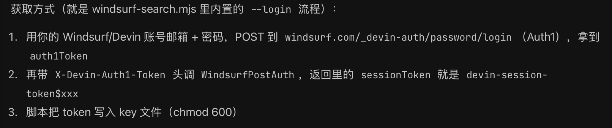

# windsurf-search-mcp

> 仓库地址：<https://github.com/mimimaster/windsurf-search-mcp.git>

把上面这个地址甩给你的 AI Agent，让它帮你搞一个 MCP 或 CLI 接入即可。

Windsurf/Devin 服务端联网搜索（`GetWebSearchResults`）的 **MCP 服务** + **CLI** 工具。

零运行时依赖，Node.js `>= 20`。

> ⚠️ 本工具通过个人 session token 调用 Windsurf/Devin 云端接口。token 会过期，且在官方客户端之外使用可能违反服务条款，风险自负。

---

## 安装

```bash
npm i -g windsurf-search-mcp
```

不装也行，直接跑：

```bash
npx -y windsurf-search-mcp --help
```

---

## 获取 Token

需要一个 Windsurf 的 token，格式形如 `devin-session-token$...`。

使用时，直接把这个仓库地址交给你的 Agent，让它以 MCP 或 CLI 的形式接入即可。不过需要先获取一个 key，大致流程如下：

1. 下载并登录 [Devin](https://windsurf.com/) 客户端
2. 让 Agent 帮你挖取 key
3. 配置好后即可使用

这样一来，就能以极低成本获得相当不错的 web_search 能力。



> 获取方式（就是 `windsurf-search.mjs` 里内置的 `--login` 流程）：
>
> 1. 用你的 Windsurf/Devin 账号邮箱 + 密码，POST 到 `windsurf.com/_devin-auth/password/login`（Auth1），拿到 `auth1Token`
> 2. 再带 `X-Devin-Auth1-Token` 头调 `WindsurfPostAuth`，返回里的 `sessionToken` 就是 `devin-session-token$xxx`
> 3. 脚本把 token 写入 key 文件（`chmod 600`）

> 也可以用邮箱密码登录自动获取（`windsurf-search --login`），但很多账号是 OAuth 登录的，密码登录会被拒绝。

---

## 使用指南

### 1. 配置 Token

拿到 token 后，保存到本地（推荐，不用把密钥写进配置文件）：

```bash
# 交互式输入（隐藏回显）
windsurf-search config set

# 或直接传入
windsurf-search config set 'devin-session-token$xxx'
```

查看当前配置（密钥会脱敏显示）：

```bash
windsurf-search config show
```

测试 token 是否可用：

```bash
windsurf-search config test
```

清除已保存的 token：

```bash
windsurf-search config clear
```

Token 解析优先级：

1. 命令行参数 `--api-key <token>`
2. 环境变量 `WINDSURF_API_KEY`
3. key 文件（按顺序找第一个存在的）：
   - `~/.config/windsurf-search/api-key`
   - `~/.windsurf-search/api-key`
   - `~/.piwin/windsurf-api-key`（兼容旧路径）

### 2. CLI 用法

直接在命令行搜索，结果输出为 JSON：

```bash
windsurf-search "tauri 窗口拖拽区域" --limit 5
```

输出：

```json
{ "hits": [ { "title": "...", "url": "...", "snippet": "...", "source": "windsurf" } ] }
```

可选参数：

| 参数 | 说明 |
|------|------|
| `--limit N` | 结果数量，1–10，默认 5 |
| `--domain example.com` | 限定域名 |
| `--mode N` | 上游搜索模式 |
| `--api-key <token>` | 直接传 token，跳过配置文件 |

### 3. MCP 服务接入

#### Cursor / Claude Desktop / 通用 MCP 客户端

在 MCP 配置中添加：

```json
{
  "mcpServers": {
    "windsurf-search": {
      "command": "npx",
      "args": ["-y", "windsurf-search-mcp"],
      "env": {
        "WINDSURF_API_KEY": "devin-session-token$..."
      }
    }
  }
}
```

> 推荐把 token 存到 key 文件里，配置中省掉 `env`，避免密钥泄露：

```json
{
  "mcpServers": {
    "windsurf-search": {
      "command": "npx",
      "args": ["-y", "windsurf-search-mcp"]
    }
  }
}
```

然后执行 `windsurf-search config set` 写入 token 即可。

#### 暴露的工具

`web_search`

| 参数 | 类型 | 必填 | 说明 |
|------|------|------|------|
| `query` | string | ✅ | 搜索关键词 |
| `limit` | number | ❌ | 结果数量，1–10，默认 5 |
| `domain` | string | ❌ | 域名过滤 |
| `mode` | number | ❌ | 上游搜索模式 |

返回 JSON 格式的搜索结果：

```json
{ "hits": [ { "title": "...", "url": "...", "snippet": "...", "source": "windsurf" } ] }
```

---

## 安全提示

- 不要把真实 token 提交到代码仓库。
- Session token 会过期，搜索返回 401 时重新执行 `config set`。
- `config show` 只会打印脱敏后的 key。
- 本项目 **不是** Windsurf/Devin 官方产品。

## License

MIT
